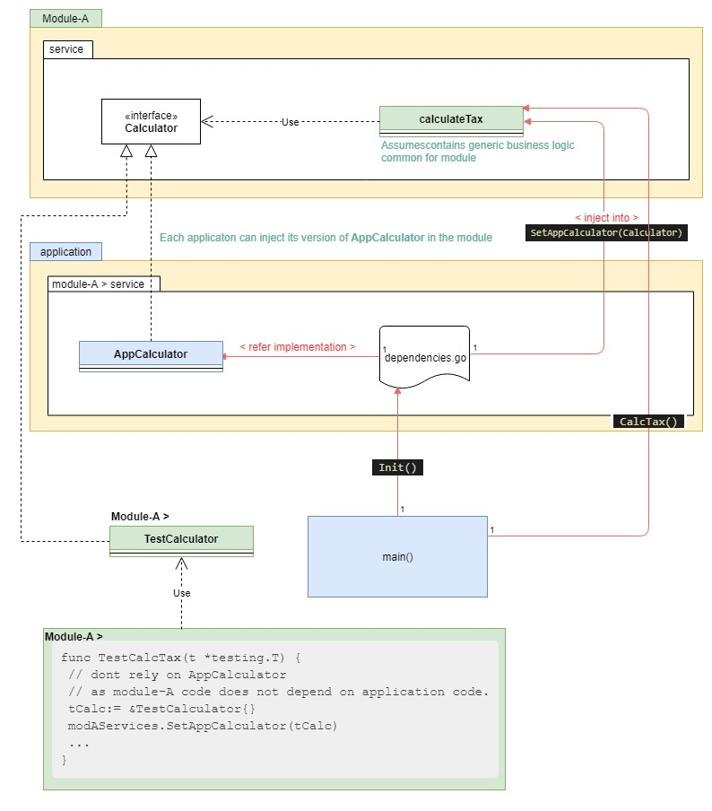

# Simple DI in Golang

[Dependency Injection](https://en.wikipedia.org/wiki/Dependency_injection) is a hot topic. Java made good with the popular framework [Spring Core](https://docs.spring.io/spring-framework/docs/current/reference/html/core.html); which later bloomed into a suite of services under [Spring framework](https://spring.io/projects/spring-framework).

## Golang's history against magic (ambiguous) code
Golang, distanced itself from `magic` or `ambiguous` code constructs. The promise (*understood by community*) was that every line of code was self explanatory. Perhaps the same reason why [Go prefers to explicitly return errors instead of Exception handling done in other languages](https://blog.golang.org/error-handling-and-go#TOC_3.). 

> ... The language's design and conventions encourage you to explicitly check for errors where they occur (as distinct from the convention in other languages of throwing exceptions and sometimes catching them).  ...

## Go breaks its own promise
Here is where the problem starts. It turns out this *promise* is harder to keep  than probably thought of. For example the introduction of [tags](https://medium.com/golangspec/tags-in-golang-3e5db0b8ef3e), according to me breaks that. Though people in the community are subtle about it; and may argue tags are still self-explanatory and don't introduce magic. I disagree, on the premise that `tags` are nothing but [annotations](https://docs.oracle.com/javase/tutorial/java/annotations/) and rely on the interpretation of meta-data supplied by tags. Anyway, we are not here to talk about `tags`, but the point being that Golang had already broken this promise. 

## Dependency Injection is required magic
From the [Quora page](https://qr.ae/pGCVF0), the following comment highlights why initially DI was not accepted in main-stream Go.

>There are a couple of Dependency Injection frameworks available for Go, but it’s fair to say that DI isn't a massively popular concept in the Go world.

> I think people are happy to pass dependencies manually, but an actual framework is little too much like magic for the Go scene I think. The Go world generally rejects things which feel too much like magic, i.e. too much mystery behind the scenes.

## Container based DI
Most of popular frameworks like [Spring](https://spring.io/projects/spring-framework) are container based, where the container abstracts the configuration, creation and wiring of the dependencies. Google has now embraced and accepted the need for DI and launched [Wire](https://github.com/google/wire) and can check [usage of wire example](https://www.nerd.vision/post/dependency-injection-in-go). This is great and I advocate the use of DI even in Go, at the cost of a little magic (*Which is hypocrisy anyway; IMO* 😊 ).

## Non-Container based; simple DI
While container based DI is the way to go for a new project. There are a lot of projects, with existing code where it may not be feasible, to bundle services into `Singleton`s and request them from a container. A lot of legacy Golang code use `functions` not `methods`; to change the entire design may not be feasible.

To get around this problem, I have created a very simple DI construct that works on the principle of Injecting the `service`s required by existing / legacy code; using `interface`s and via a single control `dependencies.go`  code config, wire by explicitly setting the dependency into the legacy; rather than modifying the legacy to request for the service (as in traditional container based DI).

The following diagram illustrates this code example:

Lets assume our legacy/existing code is in `calculateTax()` and it uses `AppCalculator()` which is hard-wired to a specific app scenario. 

We want that the `calculateTax()` code not be fixed to always use the default `AppCalculator()`. By refactoring the same code, as per diagram above and then in `dependencies.go` we can make the requirement a *runtime or configurable* dependency instead of a hard-wired one.

The re-factoring works @ 2 levels:
1. Ensure the generic code packages are not mixed with the application specific one. For this reason there are 2 packages `Module-A` and `application`.
1. The application focuses on implementation `AppCalculator.` and glue `dependencies.go`; while the Module focuses on the reusable code.

My [code on Github](https://github.com/ArjunDhar/scribbles/tree/master/DI-simple-GO) explains the working in a simplified form.

## Other alternatives

**Disclaimer**: 
> My personal suggestion is that all these alternatives are just for a good-to-know. If one wants to use a proper framework then use google [Wire]((https://github.com/google/wire)

**Happy to know peoples personal experience or recommendations on any other DI frameworks they can swear by, worth evaluation.**

* [A New, Simpler Way to Do Dependency Injection in Go](https://elliotchance.medium.com/a-new-simpler-way-to-do-dependency-injection-in-go-9e191bef50d5)
* [`dig` - Reflection based DI in go](https://github.com/uber-go/dig)
* [`goioc`](https://github.com/goioc/di)
* [`godim`](https://github.com/ekino/godim)
* ... *several more*.

