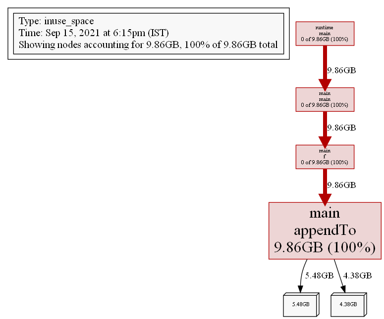
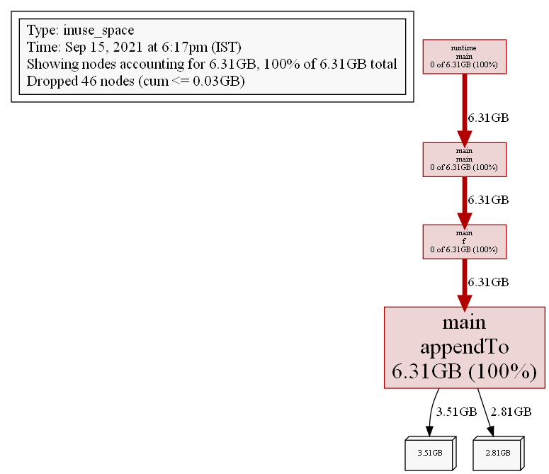
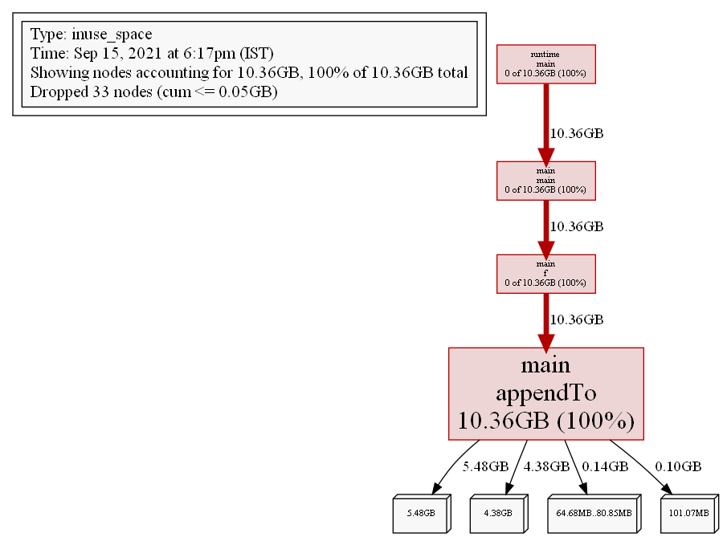
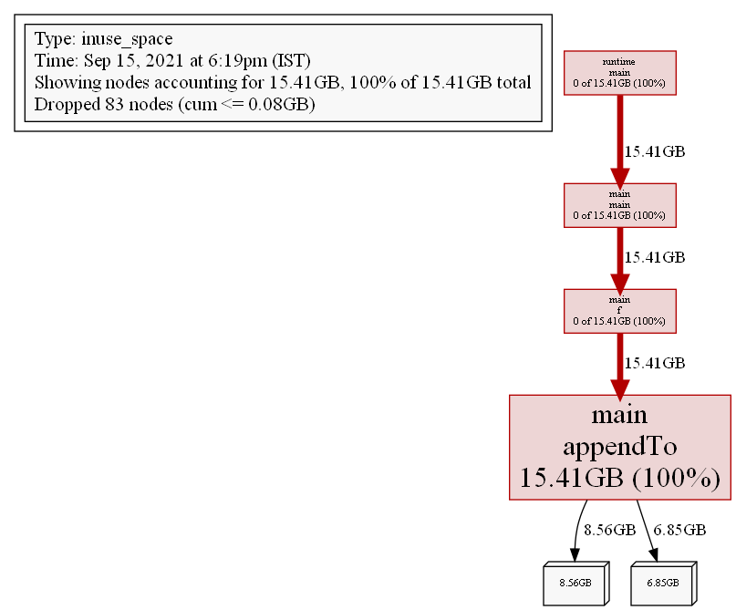
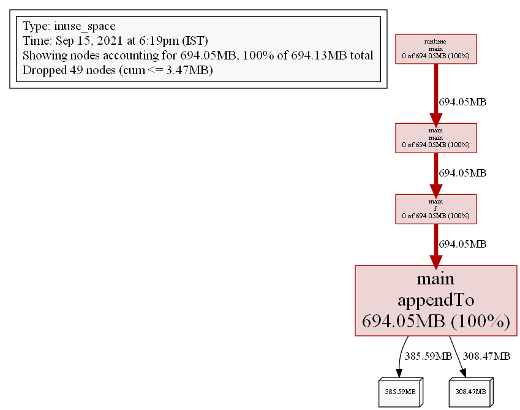
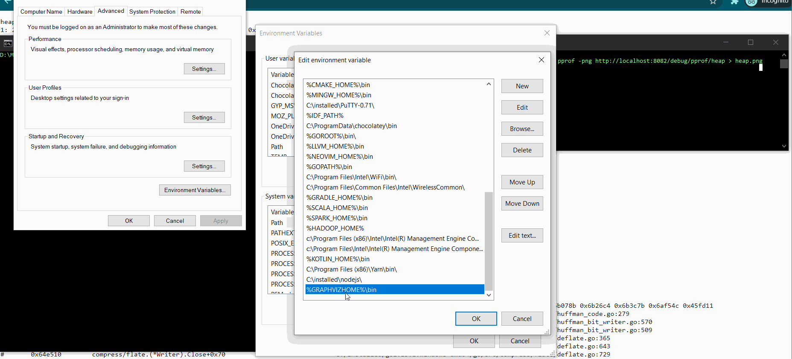

# Go `pprof` Live and in Action

There are a lot of Blogs on Go - pprof. Unfortunately, the code samples are pretty badly written or dont work off the bat. This code is a live working example of `pprof` in action.

It show cases 2 modes.
1. Via `net/http` using the Web server routes in `net/http/pprof`.`Init()` -- WORKS
1. Using `github.com/pkg/profile`; this creates `.out/mem.pprof` file but it remains @ 0KB -- FAIL

## Usage

### Build & Run
```sh
go build -o sample.exe main.go
go run main.go
```

### Access debug info
[http://localhost:8082/debug/pprof/](http://localhost:8082/debug/pprof/)

### Produce Memory Graph
Install `Graphviz` @ https://graphviz.org/download/ and ensure part of System PATH
```sh
go tool pprof -png http://localhost:8082/debug/pprof/heap > heap.png
```

## Code notes
If you increase the `ticker` time to call `clear()`; you can crash the VM @ some point.

## Sample Output

*Following are generated by `go tool` command above*<br />








### Sample CLI Out corresponding to above screens
```log
D:\...\profiling-pprof\sample>go run main.go
[main]
[Profiler started]
2021/09/15 18:14:31 profile: memory profiling enabled (rate 4096), out\mem.pprof
[f()]
[net/http] WebServer started @ http://localhost:8082/debug/pprof/
[f->go] Timer fired : Clear slice[568187513] @  2021-09-15 18:15:31.1290589 +0530 IST m=+60.008981301
[clear]
[pre-clear] len= 568294570
[post-clear] len= 0
[f->go] Timer fired : Clear slice[294187520] @  2021-09-15 18:16:31.1291916 +0530 IST m=+120.009114001
[clear]
[pre-clear] len= 294187952
[post-clear] len= 0
[f->go] Timer fired : Clear slice[294187520] @  2021-09-15 18:17:31.1301379 +0530 IST m=+180.010060301
[clear]
[pre-clear] len= 294188396
[post-clear] len= 0
[f->go] Timer fired : Clear slice[573005841] @  2021-09-15 18:18:31.1291326 +0530 IST m=+240.009055001
[clear]
[pre-clear] len= 573227942
[post-clear] len= 0
[f->go] Timer fired : Clear slice[235350016] @  2021-09-15 18:19:31.1301378 +0530 IST m=+300.010060201
[clear]
[pre-clear] len= 235351899
[post-clear] len= 0
[f->go] Timer fired : Clear slice[459668480] @  2021-09-15 18:20:31.1298302 +0530 IST m=+360.009752601
[clear]
[pre-clear] len= 459669033
[post-clear] len= 0
```

## Packages
* github.com/pkg/profile
	* https://pkg.go.dev/github.com/pkg/profile
* [Go /http/pprof](https://pkg.go.dev/net/http/pprof)

## References
*These articles were the initial source, but they all have their own holes which are put together in my code*
* [Gos pprof WebServer](https://github.com/golang/go/blob/master/src/net/http/pprof/pprof.go)
* [Find memory Leaks in Go](https://tusharsheth.medium.com/how-i-found-memory-leaks-in-the-golang-app-using-pprof-56e5d55363ba)
* [Memory leaks in Go](https://www.freecodecamp.org/news/how-i-investigated-memory-leaks-in-go-using-pprof-on-a-large-codebase-4bec4325e192/)
* [Go lang profiling](https://flaviocopes.com/golang-profiling/)
* [Go pprof trace examples](https://github.com/Raffo/go-pprof-trace-example)